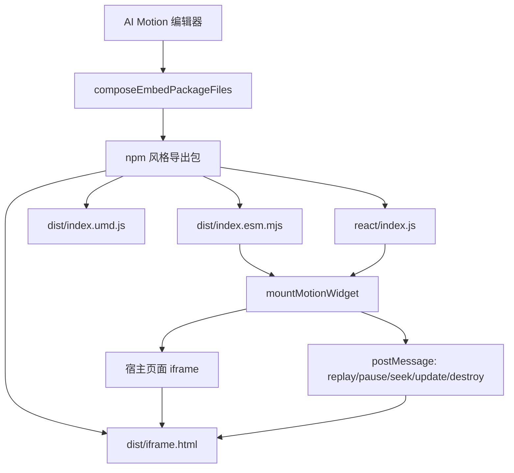

# 技术设计: 导出嵌入包升级为 NutUI React 可复用 SDK

## 技术方案

### 核心技术

- TypeScript
- JSZip
- iframe 隔离运行时
- `postMessage` 宿主与 iframe 通信
- React 16.8+ hooks 兼容 wrapper
- Vitest 单元测试

### 实现要点

- 保留 `composeEmbedPackageFiles` 作为导出入口，避免改动 UI 调用链。
- 将导出文件从根目录平铺升级为 npm 风格结构。
- 将当前 `iframe.srcdoc` 改为 `iframe.src = joinBaseUrl(baseUrl, "dist/iframe.html")`。
- iframe 内部页面负责加载 `iframe.css`、`iframe.js`、`assets/`。
- 宿主 runtime 只暴露稳定 API，不要求接入方理解 manifest 和 patch。
- React wrapper 是薄封装，只负责挂载、props 更新、卸载和 ref API。

## 架构设计



## 架构决策 ADR

### ADR-001: 保留 iframe 隔离作为第一期对外复用边界

**上下文:** NutUI React 项目存在组件库样式、移动端适配、主题变量和 H5/Taro 多端场景。直接 DOM 注入容易造成样式污染和脚本冲突。

**决策:** 第一阶段继续使用 iframe 隔离，但从 `srcdoc` 改为独立 `iframe.html` 文件加载。

**理由:** iframe 能提供清晰隔离边界，外部团队只需要处理一个容器和 `baseUrl`。独立 HTML 文件比内联 `srcdoc` 更适合 CDN、CSP 和移动端 WebView。

**替代方案:** Web Component 或 React 原生组件输出。
拒绝原因: 需要把任意 HTML/CSS/JS 动效转换为同构组件模型，范围过大；样式污染风险更高。

**影响:** iframe 有一定性能和尺寸同步开销，但可控；多实例天然隔离。

### ADR-002: 对外 API 使用 plain params，不暴露内部 patch

**上下文:** 当前项目内部使用 manifest params 和 motion patch 表达参数修改。外部团队不应依赖这些内部结构。

**决策:** 对外 runtime 暴露 `update(params: Record<string, unknown>)`，iframe 内部处理参数映射。

**理由:** plain params 更接近 React props，外部接入成本低，后续内部 patch 格式变化不会破坏外部 API。

**替代方案:** 直接暴露 `motion.patch.json` 更新协议。
拒绝原因: 泄露内部实现，升级风险高。

### ADR-003: React wrapper 兼容 React 16.8/17/18

**上下文:** NutUI React peerDependencies 支持 `react ^16.8.0 || ^17.0.0 || ^18.0.0`。

**决策:** React wrapper 不使用 React 18 专属 API，不依赖 `createRoot`。

**理由:** 最大化兼容 NutUI React 项目和存量业务项目。

**替代方案:** 只支持 React 17/18。
拒绝原因: 与 NutUI React 当前兼容范围不一致。

## API 设计

### Runtime ESM API

```ts
export type MotionWidgetParams = Record<string, unknown>;

export type MotionWidgetOptions = {
  baseUrl: string;
  params?: MotionWidgetParams;
  autoplay?: boolean;
  className?: string;
  title?: string;
};

export type MotionWidgetHandle = {
  frame: HTMLIFrameElement;
  replay(): void;
  pause(): void;
  seek(progress: number): void;
  update(params: MotionWidgetParams): void;
  destroy(): void;
};

export function mountMotionWidget(
  container: Element | string,
  options: MotionWidgetOptions
): MotionWidgetHandle;
```

### UMD API

```js
window.AiMotionWidget.mountMotionWidget(container, options);
```

保留兼容别名：

```js
window.MotionWidget.mount(container, options);
```

### React API

```ts
export type MotionWidgetReactProps = {
  baseUrl: string;
  params?: Record<string, unknown>;
  autoplay?: boolean;
  className?: string;
  title?: string;
  onReady?: (handle: MotionWidgetHandle) => void;
  onError?: (error: Error) => void;
};

export const MotionWidget: React.ForwardRefExoticComponent<
  MotionWidgetReactProps & React.RefAttributes<MotionWidgetHandle>
>;
```

### postMessage 协议

宿主到 iframe：

```ts
type HostMessage =
  | { type: "ai-motion:init"; params?: Record<string, unknown>; autoplay?: boolean }
  | { type: "ai-motion:update"; params: Record<string, unknown> }
  | { type: "ai-motion:replay" }
  | { type: "ai-motion:pause" }
  | { type: "ai-motion:seek"; progress: number }
  | { type: "ai-motion:destroy" };
```

iframe 到宿主：

```ts
type FrameMessage =
  | { type: "ai-motion:ready"; width: number; height: number }
  | { type: "ai-motion:resize"; width: number; height: number }
  | { type: "ai-motion:error"; message: string };
```

## 导出文件结构

```text
<project-id>-embed/
  package.json
  README.md
  manifest.json
  motion.patch.json
  dist/
    index.esm.mjs
    index.umd.js
    index.d.ts
    style.css
    iframe.html
    iframe.css
    iframe.js
    assets/
  react/
    index.js
    index.d.ts
  examples/
    vanilla.html
    nutui-react-demo.tsx
    react18.tsx
```

### package.json

```json
{
  "name": "@ai-motion/<project-id>",
  "version": "1.0.0",
  "main": "dist/index.umd.js",
  "module": "dist/index.esm.mjs",
  "types": "dist/index.d.ts",
  "style": "dist/style.css",
  "peerDependencies": {
    "react": "^16.8.0 || ^17.0.0 || ^18.0.0"
  },
  "sideEffects": ["dist/style.css"]
}
```

## 安全与性能

- **安全:** Runtime 只接受预定义 message type；忽略未知消息；`baseUrl` 只用于 iframe `src` 和资源相对路径，不执行动态代码。
- **安全:** iframe 默认不向宿主注入 DOM，不读取宿主页面数据。
- **性能:** 参数更新通过 `postMessage` 发送增量，不重建 iframe。
- **性能:** 尺寸同步使用 ResizeObserver，不做高频轮询。
- **兼容:** React wrapper 避免 React 18 API；运行时使用普通 DOM API。

## 测试与部署

- **测试:** 使用 Vitest 覆盖 `composeEmbedPackageFiles` 输出结构和内容。
- **测试:** 使用 jsdom 覆盖 runtime mount/update/destroy 基础行为。
- **测试:** React wrapper 用现有测试框架验证 mount、props update、unmount。
- **部署:** 不改变当前云部署脚本；导出包由浏览器端 zip 生成。
- **验收:** 使用 `pnpm --filter @motion-tool/core test -- exportPackage.test.ts` 和相关 web 测试回归。
