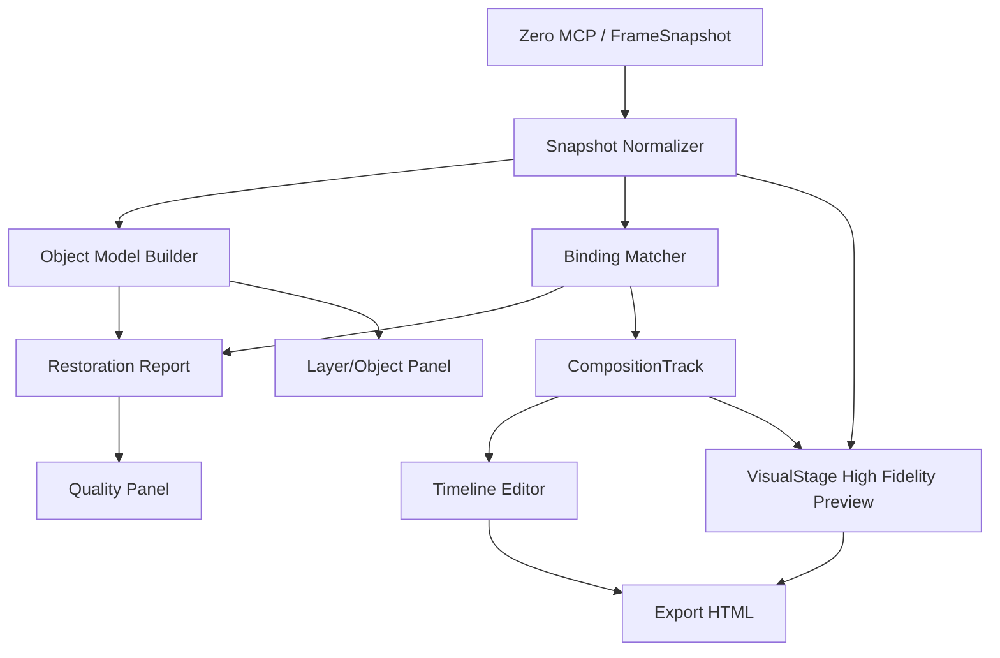

# 技术设计: 帧间还原能力产品化增强

## 技术方案

### 核心技术
- React 19 + TypeScript 5.8 + Vite。
- `packages/motion-copilot-core` 承载纯函数能力：快照规范化、节点匹配、对象识别、评分报告、时间轴生成。
- `apps/motion-copilot` 承载交互能力：报告展示、匹配编辑、对象图层、预览联动。
- 继续复用 `ZeroVisualSnapshot`、`VisualStage`、`CompositionTrack`、`MotionDocument.visualSource`。

### 实现要点
1. 新增 `RestorationReport`，从快照、绑定结果、生成文档、视觉源中计算质量诊断。
2. 新增 `FrameObjectModel`，把节点聚合成对象：button、status-pill、label-group、container、text、asset。
3. 改造帧间面板，将 matched / enter / exit / unresolved 从计数展示升级为可编辑列表。
4. 保持高保真结果层由 `VisualStage` 渲染，避免把复杂 SVG/图片全部重绘成低保真 DOM。
5. 将真实反馈样本沉淀为 fixture，覆盖样式、层级、命名、选中、导出五类回归。

## 架构设计



## 架构决策 ADR

### ADR-001: 高保真结果层优先，原生可编辑逐步增强
**上下文:** 低保真路径能编辑，但难以完整还原设计稿；高保真路径能还原，但编辑能力依赖代理层。  
**决策:** 保持高保真 `VisualStage` 为结果层，代理层和对象模型只负责选择、参数、时间轴、局部编辑。  
**理由:** 结果视觉正确是动效工具的底线，不能为了“全可编辑”牺牲首尾帧还原。  
**替代方案:** 全部 Zero 节点转为 MotionLayer → 拒绝原因: 复杂 SVG、字体、mask、阴影会持续失真。  
**影响:** 需要在 UI 中清楚解释“视觉节点 / 代理图层 / 对象”的关系。

### ADR-002: 评分报告必须可行动，不做单纯分数
**上下文:** 总分对用户有帮助，但不能定位具体问题。  
**决策:** 每个扣分项必须包含 nodeId、字段、严重级别、原因、建议动作。  
**理由:** 评分报告的价值在于指导修复和沉淀回归，不是制造一个漂亮分数。  
**替代方案:** 只显示百分制分数 → 拒绝原因: 不能提升真实还原链路。  
**影响:** 需要维护 issue schema，并在测试中验证关键问题能被报告出来。

### ADR-003: 匹配不可信时宁可待确认，不静默猜测
**上下文:** 同名节点如 `文字 159` 容易误配，导致错误 morph。  
**决策:** 低置信度或冲突匹配必须进入待确认，由用户或后续 AI 修正。  
**理由:** 错误自动匹配比显式待确认更危险。  
**替代方案:** 根据最高分强行匹配 → 拒绝原因: 会产生难以发现的错误动效。  
**影响:** UI 需要提供手动修正匹配关系的能力。

## API设计

### Core API: `createRestorationReport(input)`
- **请求:**
```ts
type CreateRestorationReportInput = {
  from: ZeroVisualSnapshot | FrameSnapshot;
  to: ZeroVisualSnapshot | FrameSnapshot;
  bindings: VisualMotionBindingResult | FrameElementMatchResult;
  document?: MotionDocument;
  objectModel?: FrameObjectModel;
};
```
- **响应:**
```ts
type RestorationReport = {
  score: number;
  summary: string;
  generatedAt: string;
  inputHash: string;
  bindingHash: string;
  metrics: {
    nodeCoverage: RestorationMetric;
    styleCoverage: RestorationMetric;
    layerOrderConfidence: RestorationMetric;
    matchConfidence: RestorationMetric;
    visualRisk: RestorationMetric;
  };
  issues: RestorationIssue[];
};

type RestorationMetric = {
  value: number | null;
  status: "ok" | "warning" | "error" | "unknown" | "not-applicable";
  weight: number;
};
```

### 评分规则

总分只作为辅助信息，不作为唯一验收标准。计算方式必须稳定、可解释：

```ts
score = round(
  sum(metric.value * metric.weight for available metrics) /
    sum(metric.weight for available metrics)
);
```

- `nodeCoverage` 权重 30：首尾帧关键节点是否进入可渲染或代理链路。
- `styleCoverage` 权重 25：圆角、背景、边框、阴影、字体、图片、SVG 等关键样式是否保留。
- `layerOrderConfidence` 权重 20：zIndex / DOM 顺序 / 视觉堆叠关系是否可信。
- `matchConfidence` 权重 15：matched / enter / exit 判断是否稳定，低置信度不静默通过。
- `visualRisk` 权重 10：跨域资源、缺 screenshot、metadata-only、iframe 选择失败等渲染风险。
- `unknown` 不参与加权，但必须生成 warning issue，说明缺少哪个输入。
- `not-applicable` 不参与加权，也不扣分，例如没有文本节点时不检查字体。
- 任一 `error` issue 可将对应 metric 上限压到 60；任一 `warning` issue 可将对应 metric 上限压到 85。
- 如果 `inputHash` 或 `bindingHash` 变化，旧报告只能标记为 stale，不能继续作为当前质量结论。

### Core API: `buildFrameObjectModel(snapshot)`
- **请求:** `ZeroVisualSnapshot | FrameSnapshot`
- **响应:** `FrameObjectModel`
- **说明:** P0 阶段只做 text / container / asset 三类纯几何识别（parent-child 包含关系 + bounds 尺寸比例）。button / status-pill / label-group 归为 P1 阶段，可接 AI 语义分类。
- **性能约束:** 节点数 <1000 时须在 50ms 内完成；实现后必须跑 benchmark 验证，不达标则做惰性计算或剪枝优化。

### App UI: 帧间质量面板
- 默认展示 issue 分级汇总（error/warning/info 各几条）和关键风险条目。
- 总分作为辅助信息放二级展示，不作为主指标。
- 支持点击 issue 定位到 preview 节点、对象图层、时间轴片段。

## 数据模型

```ts
type RestorationIssueSeverity = "info" | "warning" | "error";
type RestorationIssueSource = "input-missing" | "conversion-lost" | "render-risk" | "user-change";

type RestorationIssue = {
  id: string;
  severity: RestorationIssueSeverity;
  source: RestorationIssueSource;
  category: "node" | "style" | "layer-order" | "match" | "asset" | "export";
  nodeId?: string;
  layerId?: string;
  field?: string;
  title: string;
  reason: string;
  suggestion: string;
};

type FrameObjectKind =
  | "button"
  | "status-pill"
  | "label-group"
  | "container"
  | "text"
  | "asset"
  | "unknown";

type FrameObject = {
  id: string;
  kind: FrameObjectKind;
  name: string;
  nodeIds: string[];
  bounds: { x: number; y: number; w: number; h: number };
  children: FrameObject[];
  confidence: number;
};

type FrameObjectModel = {
  frameId: string;
  objects: FrameObject[];
  unresolvedNodeIds: string[];
};

/** 用户手动修正的绑定覆盖，持久化到 MotionDocument.visualSource 中 */
type UserBindingOverride = {
  fromNodeId: string;
  toNodeId?: string;
  action: "matched" | "enter" | "exit" | "ignore";
};

type VisualCompositionReportCache = {
  report: RestorationReport;
  inputHash: string;
  bindingHash: string;
  generatedAt: string;
};
```

### 持久化落点

必须修改 `packages/motion-copilot-core/src/schema/document.ts` 中的 `VisualCompositionSource`，当前真实结构位于该文件约第 410 行。

```ts
export type VisualCompositionSource = {
  kind: "zero-visual-morph";
  from: VisualCompositionSnapshotSource;
  to: VisualCompositionSnapshotSource;
  bindingResult: VisualCompositionBindingSource;
  userBindingOverrides?: UserBindingOverride[];
  restorationReportCache?: VisualCompositionReportCache;
};
```

- `userBindingOverrides` 只保存人工修正，不覆盖原始 `bindingResult`，编译时按“原始结果 + 用户覆盖”合并。
- `restorationReportCache` 只缓存上次报告；当 `from/to/bindingResult/userBindingOverrides` 任一变化导致 hash 改变，UI 必须显示 stale 并触发重算入口。
- `inputHash` 覆盖首尾帧快照关键结构与资源引用；`bindingHash` 覆盖绑定结果与用户覆盖。
- 旧项目没有这些字段时按空数组 / 无缓存兼容。

### 与已有 `MorphIssue` 的边界

| 类型 | 职责 | 产生阶段 | 展示位置 |
|------|------|----------|----------|
| `MorphIssue` | 时间轴编排问题（track 缺失、timing 冲突、easing 不合理） | `compileMorphPlan` / `evaluateMorphPlan` | 时间轴面板 |
| `RestorationIssue` | 导入还原质量问题（样式丢失、节点覆盖不足、层级错乱、匹配不可信） | `createRestorationReport` | 质量面板 |

两者并存，不合并。

## 安全与性能
- **安全:** `VisualStage` 继续使用 iframe sandbox，不允许远程 JS；报告只处理快照结构，不执行用户 HTML。
- **性能:** 报告计算必须是纯函数，节点数小于 1000 时在 50ms 内完成；复杂视觉 diff 放到显式 QA 脚本，不阻塞主 UI。
- **降级:** metadata-only 输入仍走低保真/调试路径，并明确提示不可标记为高保真。

## 测试与部署
- **单元测试:** 覆盖报告评分、对象识别、匹配置信度、样式缺失、层级顺序。
- **集成测试:** 覆盖帧间面板从 Zero fixture 生成、报告展示、issue 定位、手动修正、导出。
- **真机回归:** 将状态条样例作为标准 fixture，确保圆角背景、绿点绿字层级、点击选中、高保真 SVG 背景长期不回退。
- **部署:** 仅影响 Motion Copilot 独立模块，不改 `apps/web`。
